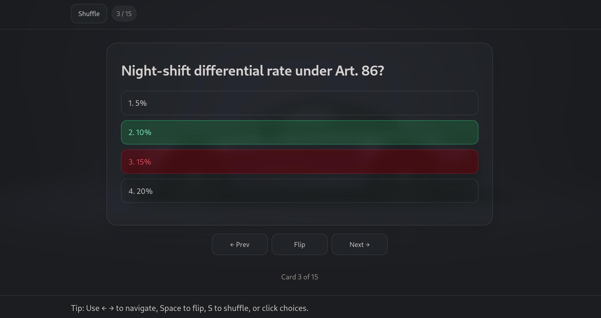
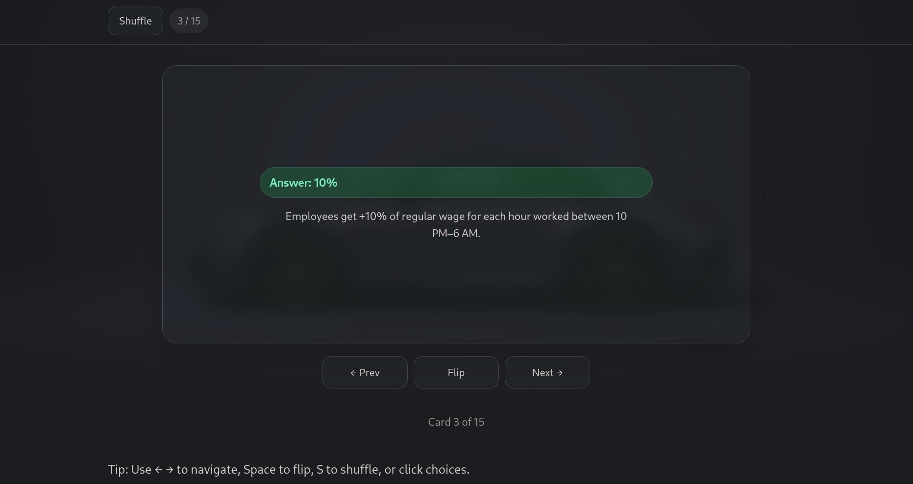
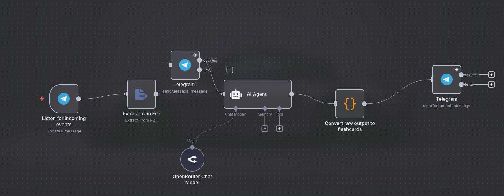
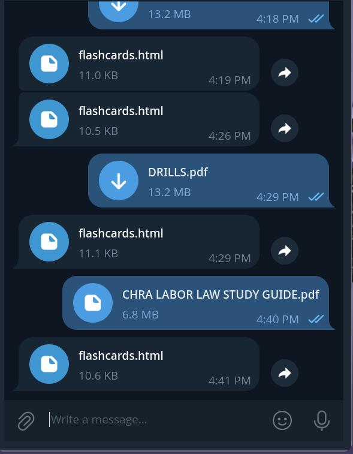
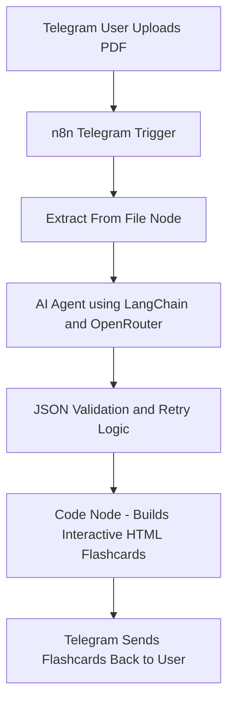

# ⚡ FlashMind AI Flashcard Bot
Turn any PDF into interactive flashcards and quizzes directly from Telegram using unlimited free AI prompts via OpenRouter.

---

## 🧠 Overview

**FlashMind** is an AI-powered Telegram bot that converts uploaded PDF files into **multiple-choice flashcards** and interactive quizzes.

It uses **n8n** as the automation brain, **OpenRouter** for free AI inference, and a custom **HTML/JS quiz engine** for delivery all without any external backend or paid API costs.

---
> ⚠️ **Note:**  
> This project is fully functional but currently **not operational** since it depends on my local **n8n instance** being online.  
> You can still explore the workflow JSON, screenshots, architecture, and code to see how it all works end-to-end.
---

## 📸 Screenshots

## 🏗️ Architecture

